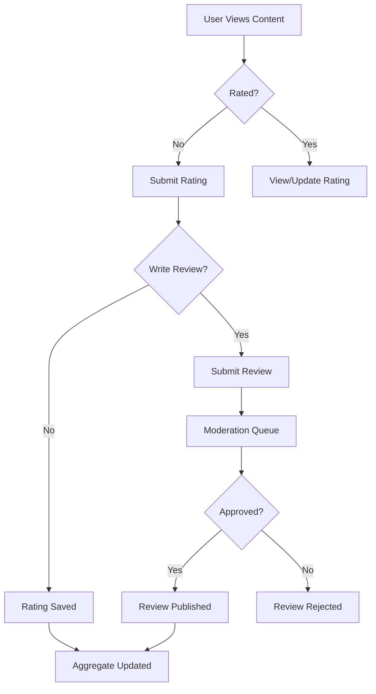

# Product Requirements Document (PRD) - Rating Module

**Module**: Rating
**Version**: 1.0
**Status**: Draft
**Last Updated**: 2026-03-12
**Author**: Product Team

---

## Document Control

| Version | Date | Author | Changes |
|---------|------|--------|---------|
| 1.0 | 2026-03-12 | Product Team | Initial draft |

---

## 1. Executive Summary

### 1.1 Problem Statement
> User ratings and reviews are essential for building trust, providing social proof, and enabling quality assessment across platform content. Without a unified rating system, each module implements its own rating logic, leading to inconsistent UX, fragmented data, and missed opportunities for cross-content quality insights. The platform needs a centralized rating and review module to manage ratings, reviews, reputation scores, and quality metrics consistently.

### 1.2 Proposed Solution
> The Rating module provides comprehensive rating and review infrastructure including star ratings, thumbs up/down, detailed reviews, review moderation, helpfulness voting, reputation scoring, rating analytics, and integration with all content modules. It supports multiple rating types, prevents abuse, and provides actionable quality insights for content creators and platform operators.

### 1.3 Business Value Proposition
- **Primary Value**: Unified rating system enabling trust and quality assessment
- **Secondary Value**: Content quality insights, user engagement, SEO benefits
- **Strategic Alignment**: Trust and safety, content quality, user engagement

### 1.4 Success Metrics (High-Level)
| Metric | Current | Target | Timeline |
|--------|---------|--------|----------|
| Rating Coverage | N/A | 80% of content | Q3 2026 |
| Review Submission Rate | N/A | 10% of users | Q3 2026 |
| Rating Quality Score | N/A | 4.0/5 average | Q3 2026 |
| Review Helpfulness | N/A | 70% positive | Q3 2026 |

---

## 2. Goals & Objectives

### 2.1 Primary Goals (SMART)
1. **Specific**: Build unified rating and review system with moderation and analytics
2. **Measurable**: Achieve 80% rating coverage, 10% review submission rate
3. **Achievable**: Leverage existing User module, Filament admin
4. **Relevant**: Critical for trust, quality assessment, and engagement
5. **Time-bound**: Core ratings by Q2 2026, advanced features by Q3 2026

### 2.2 Secondary Goals
- Implement reviewer reputation system
- Build review verification (verified purchases/actions)
- Create rating-based recommendations
- Develop spam and abuse detection

### 2.3 Non-Goals
> What this module will NOT do (scope boundaries)
- E-commerce product reviews (use commerce modules)
- Employee performance reviews (HR system)
- Complex survey systems (dedicated survey tools)

### 2.4 Key Results (OKRs)
| Objective | Key Result | Target | Status |
|-----------|------------|--------|--------|
| Rating Excellence | Content with ratings | 80% | Pending |
| Review Quality | Average rating quality | 4.0/5 | Pending |
| User Engagement | Review submission rate | 10% | Pending |
| Trust & Safety | Fake review rate | <1% | Pending |

---

## 3. Target Users

### 3.1 User Personas

#### Persona 1: Reviewer
| Attribute | Details |
|-----------|---------|
| Role | Platform User |
| Goals | Share opinions, help others make decisions |
| Pain Points | Complex review forms, no visibility |
| Technical Level | Basic |
| Usage Frequency | Weekly |

**User Story**:
> As a Reviewer, I want to easily rate and review content, so that I can share my experience and help others.

#### Persona 2: Content Consumer
| Attribute | Details |
|-----------|---------|
| Role | Platform User |
| Goals | Make informed decisions based on ratings |
| Pain Points | Fake reviews, unclear ratings |
| Technical Level | Basic |
| Usage Frequency | Daily |

**User Story**:
> As a Content Consumer, I want to see authentic ratings and helpful reviews, so that I can make informed decisions.

#### Persona 3: Content Creator
| Attribute | Details |
|-----------|---------|
| Role | Author/Creator |
| Goals | Understand content quality perception |
| Pain Points | No feedback, unfair ratings |
| Technical Level | Intermediate |
| Usage Frequency | Weekly |

**User Story**:
> As a Content Creator, I want to see ratings and feedback on my content, so that I can improve and understand my audience.

### 3.2 Use Cases
| ID | Use Case | Actor | Trigger | Outcome |
|----|----------|-------|---------|---------|
| UC-001 | Rate content | User | Consumed content | Rating submitted |
| UC-002 | Write review | User | Strong opinion | Review published |
| UC-003 | Vote helpful | User | Read review | Helpfulness recorded |
| UC-004 | Report review | User | Inappropriate content | Report submitted |
| UC-005 | Moderate review | Moderator | Report/flag | Review action |
| UC-006 | View ratings | User | Browse content | Rating displayed |

### 3.3 Pain Points Addressed
| Pain Point | Severity | How Solved |
|------------|----------|------------|
| Fake reviews | High | Verification, moderation |
| Rating manipulation | High | Abuse detection |
| No review visibility | Medium | Helpful sorting |
| Inconsistent ratings | Medium | Unified system |

---

## 4. Functional Requirements

### 4.1 Requirements Matrix

| ID | Requirement | Description | Priority | Acceptance Criteria |
|----|-------------|-------------|----------|---------------------|
| FR-001 | Star Ratings | 1-5 star rating system | P0 | Star input, display |
| FR-002 | Thumbs Up/Down | Binary rating option | P1 | Like/dislike |
| FR-003 | Written Reviews | Text review submission | P0 | Rich text support |
| FR-004 | Review Moderation | Approve, reject, edit | P1 | Moderation queue |
| FR-005 | Helpfulness Voting | Vote reviews helpful | P2 | Helpfulness score |
| FR-006 | Review Reporting | Report inappropriate | P1 | Report workflow |
| FR-007 | Rating Aggregation | Calculate averages | P0 | Accurate calculations |
| FR-008 | Verified Reviews | Mark verified users | P2 | Verification badge |
| FR-009 | Review Responses | Creator responses | P2 | Response thread |
| FR-010 | Rating Analytics | Quality insights | P2 | Analytics dashboard |
| FR-011 | Spam Detection | Detect fake reviews | P1 | AI-powered detection |
| FR-012 | Review Sorting | Sort by relevance | P1 | Multiple sort options |

### 4.2 Priority Definitions
- **P0 (Critical)**: Must have for launch - star ratings, reviews
- **P1 (High)**: Should have - moderation, reporting, spam detection
- **P2 (Medium)**: Nice to have - helpfulness, verification, responses
- **P3 (Low)**: Future consideration - advanced analytics

### 4.3 Feature Details

#### Feature 1: Rating System
**Description**: Multi-type rating system supporting star ratings, thumbs up/down, and custom rating scales.

**User Flow**:
```
1. User views content
2. Clicks rating component
3. Selects rating (stars, thumb)
4. Optionally writes review
5. Submits rating
6. Rating displayed with aggregate
```

**Acceptance Criteria**:
- [ ] 5-star rating input
- [ ] Half-star support
- [ ] Thumbs up/down option
- [ ] Rating display with average
- [ ] Rating count display
- [ ] User's rating highlighted

**Dependencies**: User Module

#### Feature 2: Review Management
**Description**: Complete review lifecycle from submission to moderation with helpfulness and reporting.

**Acceptance Criteria**:
- [ ] Review submission form
- [ ] Character limits
- [ ] Rich text formatting
- [ ] Review editing
- [ ] Review deletion (own)
- [ ] Moderation queue
- [ ] Approval/rejection workflow

**Dependencies**: User Module, Activity Module

#### Feature 3: Review Quality System
**Description**: Helpfulness voting, verification, and spam detection for review quality.

**Acceptance Criteria**:
- [ ] Helpful/not helpful voting
- [ ] Verified reviewer badge
- [ ] Spam detection (AI)
- [ ] Review quality scoring
- [ ] Sort by helpfulness
- [ ] Report inappropriate reviews

**Dependencies**: AI Module

---

## 5. Non-Functional Requirements

### 5.1 Performance Requirements
| Metric | Requirement | Measurement |
|--------|-------------|-------------|
| Rating Load | <100ms | Rating display |
| Review Submit | <500ms | Submission time |
| Aggregate Calc | <200ms | Average calculation |
| Cache Hit Rate | 90%+ | Rating cache |
| Availability | 99.9% | Monthly uptime |

### 5.2 Security Requirements
- [x] Authentication for reviews
- [x] Authorization (own reviews)
- [x] Rate limiting
- [x] Spam prevention
- [x] XSS protection
- [x] Audit logging

### 5.3 Scalability Requirements
- Support for 1M+ ratings
- Efficient aggregation
- Review caching strategy
- Database indexing

### 5.4 Compliance Requirements
- [x] GDPR (review deletion)
- [x] Fake review prevention
- [x] Transparency (verified status)

---

## 6. User Experience

### 6.1 User Flows


### 6.2 Wireframes
> [Links to Figma/Sketch wireframes - to be created]

### 6.3 Design Principles
- Simple, intuitive rating interface
- Clear aggregate display
- Trust indicators (verified, helpful)
- Accessible rating controls

### 6.4 Interaction Specifications
| Interaction | Behavior | Feedback |
|-------------|----------|----------|
| Rate | Click stars | Stars highlight |
| Review | Submit form | Confirmation |
| Vote Helpful | Click button | Count update |
| Report | Click report | Confirmation |

---

## 7. Technical Considerations

### 7.1 Architecture Overview
```
┌─────────────────────────────────────────────────────────┐
│                   Rating Module                         │
│  ┌──────────────┐  ┌──────────────┐  ┌──────────────┐  │
│  │ Rating       │  │ Review       │  │ Moderation   │  │
│  │ System       │  │ Management   │  │ System       │  │
│  └──────────────┘  └──────────────┘  └──────────────┘  │
│  ┌──────────────┐  ┌──────────────┐  ┌──────────────┐  │
│  │ Helpfulness  │  │ Spam         │  │ Analytics    │  │
│  │ Voting       │  │ Detection    │  │ Dashboard    │  │
│  └──────────────┘  └──────────────┘  └──────────────┘  │
└─────────────────────────────────────────────────────────┘
              │              │              │
              ▼              ▼              ▼
    ┌─────────────┐ ┌─────────────┐ ┌─────────────┐
    │    User     │ │     AI      │ │   Cache     │
    │   Module    │ │   Module    │ │   (Redis)   │
    └─────────────┘ └─────────────┘ └─────────────┘
```

### 7.2 Dependencies
| Dependency | Type | Version | Criticality |
|------------|------|---------|-------------|
| Laravel | Framework | 12.x | Critical |
| Filament | UI Framework | 5.x | High |
| User Module | Internal | 1.x | Critical |
| AI Module | Internal | 1.x | Medium |

### 7.3 Integration Points
| System | Integration Type | Data Flow | Frequency |
|--------|------------------|-----------|-----------|
| Blog Module | Article Ratings | Inbound | Per article |
| Predict Module | Market Ratings | Inbound | Per market |
| User Module | User Reviews | Bidirectional | Per review |
| AI Module | Spam Detection | Outbound | Per review |

### 7.4 Technical Constraints
- PHP 8.3+ required
- Laravel 12+ required
- Filament v5 compatibility

### 7.5 Database Schema
```sql
CREATE TABLE ratings (
    id BIGINT UNSIGNED AUTO_INCREMENT PRIMARY KEY,
    user_id BIGINT UNSIGNED,
    rateable_type VARCHAR(255),
    rateable_id BIGINT UNSIGNED,
    rating TINYINT,
    created_at TIMESTAMP DEFAULT CURRENT_TIMESTAMP,
    updated_at TIMESTAMP DEFAULT CURRENT_TIMESTAMP ON UPDATE CURRENT_TIMESTAMP,
    
    UNIQUE KEY unique_user_rateable (user_id, rateable_type, rateable_id),
    INDEX idx_rateable (rateable_type, rateable_id)
);

CREATE TABLE reviews (
    id BIGINT UNSIGNED AUTO_INCREMENT PRIMARY KEY,
    user_id BIGINT UNSIGNED,
    reviewable_type VARCHAR(255),
    reviewable_id BIGINT UNSIGNED,
    rating TINYINT,
    title VARCHAR(255),
    content TEXT,
    status ENUM('pending', 'approved', 'rejected'),
    is_verified BOOLEAN DEFAULT FALSE,
    helpful_count INT DEFAULT 0,
    not_helpful_count INT DEFAULT 0,
    created_at TIMESTAMP DEFAULT CURRENT_TIMESTAMP,
    updated_at TIMESTAMP DEFAULT CURRENT_TIMESTAMP ON UPDATE CURRENT_TIMESTAMP,
    
    INDEX idx_reviewable (reviewable_type, reviewable_id),
    INDEX idx_status (status)
);

CREATE TABLE review_votes (
    id BIGINT UNSIGNED AUTO_INCREMENT PRIMARY KEY,
    review_id BIGINT UNSIGNED,
    user_id BIGINT UNSIGNED,
    vote_type TINYINT,
    created_at TIMESTAMP DEFAULT CURRENT_TIMESTAMP,
    
    UNIQUE KEY unique_review_user (review_id, user_id)
);

CREATE TABLE review_reports (
    id BIGINT UNSIGNED AUTO_INCREMENT PRIMARY KEY,
    review_id BIGINT UNSIGNED,
    user_id BIGINT UNSIGNED,
    reason VARCHAR(255),
    status ENUM('pending', 'resolved', 'dismissed'),
    created_at TIMESTAMP DEFAULT CURRENT_TIMESTAMP,
    
    INDEX idx_review (review_id),
    INDEX idx_status (status)
);
```

---

## 8. Analytics & Metrics

### 8.1 Success Metrics (KPIs)
| KPI | Definition | Target | Measurement Method |
|-----|------------|--------|-------------------|
| Rating Coverage | % content rated | 80% | Content audit |
| Review Rate | % users who review | 10% | User tracking |
| Average Rating | Mean rating | 4.0/5 | Rating aggregation |
| Helpful Rate | % helpful votes | 70% | Vote tracking |

### 8.2 Tracking Requirements
- Rating distribution
- Review submission trends
- Helpfulness metrics
- Spam detection rates

### 8.3 Reporting Dashboards
- Rating overview
- Review queue
- Quality metrics
- Spam reports

---

## 9. Timeline & Milestones

### 9.1 Key Dates
| Milestone | Date | Status |
|-----------|------|--------|
| Requirements Complete | 2026-03-12 | Complete |
| Design Complete | 2026-03-26 | Pending |
| Development Start | 2026-03-27 | Pending |
| Core Features (P0) | 2026-04-17 | Pending |
| Beta Launch | 2026-04-24 | Pending |
| GA Launch | 2026-05-08 | Pending |

---

## 10. Open Questions

| ID | Question | Owner | Due Date | Status |
|----|----------|-------|----------|--------|
| Q-001 | Should reviews require approval by default? | Product | 2026-03-20 | Open |
| Q-002 | What is the minimum rating threshold? | Product | 2026-03-20 | Open |
| Q-003 | Should we allow anonymous reviews? | Product | 2026-03-20 | Open |

---

## 11. Appendix

### 11.1 Glossary
| Term | Definition |
|------|------------|
| Rating | Numeric score (1-5 stars) |
| Review | Written feedback with rating |
| Verified Review | From confirmed user/action |
| Helpfulness | User vote on review quality |

### 11.2 References
- [Laravel Documentation](https://laravel.com/docs)
- [Filament Documentation](https://filamentphp.com/docs)

### 11.3 Related PRDs
- [Blog Module PRD](../Blog/docs/PRD.md)
- [Predict Module PRD](../Predict/docs/PRD.md)
- [User Module PRD](../User/docs/PRD.md)
- [AI Module PRD](../AI/docs/PRD.md)

---

## Approval

| Role | Name | Signature | Date |
|------|------|-----------|------|
| Product Manager | | | |
| Engineering Lead | | | |
| Design Lead | | | |
| Stakeholder | | | |
